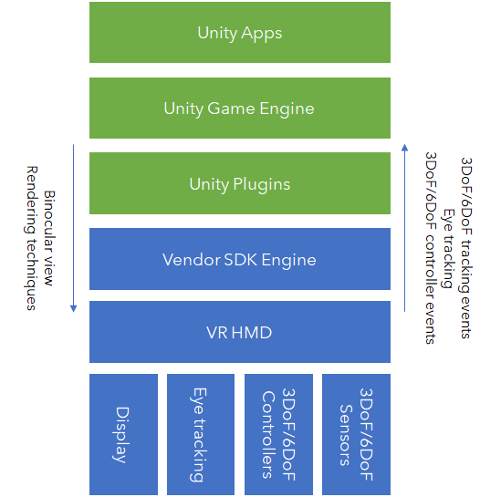
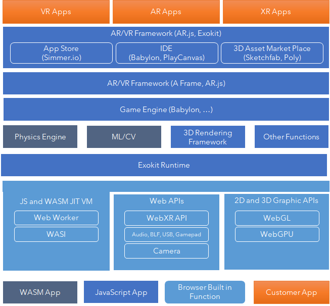
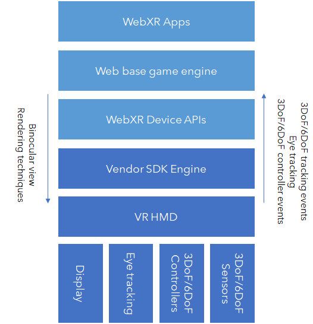
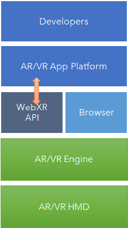
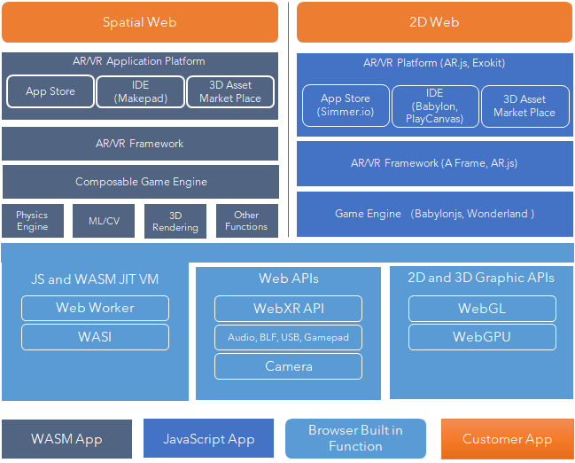

随着5G的全面铺开，AR/VR行业面临一个最好的发展机会，尤其covid19全球疫情导致online交互成为大部分人的生活常态，AR/VR的沉浸式的互动体验相比2D视讯有明显的优势，在视频、游戏、电商、企业远程办公、工业培训和远程支持等领域出现了很多的需求。

另一方面AR/VR硬件的品质不断提升，Oculus Quest、华为VR3等等高性价比移动VR产品已经接近大规模商用的零界点。然而VR/AR的应用开发工具、内容平台、开发者数量和质量等还是制约产业大规模发展的瓶颈。

## 当前AR/VR应用开的存在的问题

 - AR/VR的应用开发的目前借用了游戏的开发生态，其中90%的AR/VR应用使用Unity平台开发，Unity有大约4.5M的全球开发者，相比之下全球有24M的web开发者和14M的移动应用开发者，单一的工具和较少的开发者生态导致AR/VR应用的开发成本比较高。
 - 内容制作作成本高，3D动画和360视频的制作工具链和计算存储成本都很高
 - AR/VR应用的盈利模式不清晰

这些问题的中有些需要进一步提升硬件设备的性价比，不断提高渗透率，通过足够数量的用户群体来吸引开发者投入，同时也亟需在打通和AR/VR和web和移动生态之间的桥梁
 - 赋予web和移动开发者快速低成本开发AR/VR应用的能力也很重要，例如：在移动应用初期，原生工具生态很小的时候，有大量的HTML5应用满足用户访问服务的需求
 - 能够借用web平台的广泛分发渠道，丰富的变现方式，把大量的web内容适配到AR/VR设备，在移动应用发展的初期，也曾有过大量的移动web浏览器和内容适配服务，把web内容适配到移动设备上。

和web开发者生态的对接和内容适配对AR应用更为关键，因为AR本质上是一个外化的互联网，数字的互联网的内容需要投射到这个新的物理互联网上。
 
 AR/VR计算平台选择必然是需要多元化的，是这个产业能成长为mobile产业下一跳的一个必然条件。Unity，Unreal这些游戏引擎 已经暴露出了商业和技术上的局限性。
 

 - Unity缺乏并行大规模渲染能力，需要Improbable的Spatial OS这样的外挂才能实现，这个能力对大规模的社交应用开发非常重要
 
 - Unity游戏引擎的信息模型不符合AR/VR这种平行宇宙（ meta verse）的信息模型，Unity的内容是pre-defined的交互模式，素材、动画和脚本一起打包下发，应用不支持动态加载动画内容。而在AR应用中，AR应用依赖场景识别来触发投放，在VR社交应用中，虚拟世界中的应用投放也是动态的，meta verse更加类似web的HTML信息模型，世界通过一个编址系统链接（URL）在一起，可以从一个网页（世界）跳转到另一个网页（世界）。比web模型更加复杂的是meta verse的信息模型要求这些世界的显示和消隐是由物理位置坐标决定的，对app的加载速度和并发显示的能力要求都很高。
 
 - Unity的商业模式是基于收入的SaaS模式，和游戏不一样，AR/VR应用的分发和变现方式都远远比游戏复杂，如何确认收入是一个很大的问题，具工具的价格对全球的开发者而言也过于昂贵。
 
 - AR/VR应用厂家通过Unity Plugin提供硬件能力给Unity开发者，深度整合硬件要求Unity提供商业支持，而且价格不菲。

 下图是Unity和AR/VR HMD厂家之间的对接关系
 

 - Unity本身有大量的开源软件组件，例如：Bullet物理引擎，底层基于GPU的渲染技术，其工具核心是一个很完整的集成开发环境和适配各个OS平台的runtime，和多平台应用的编译部署工具，通过丰富的工具链对接3D内容制作体系。
 
 ## 基于web的开放开源AR/VR应用开放平台如火如荼
 
WebXR是W3C支持的AR/VR设备API标准，旨在提供一个标注化的AR/VR设备API，构建一个基于开放Web平台的AR/VR计算平台。Web生态中已经出现了基于webXR的游戏引擎、开发者工具、内容生态等可惜的变化，很多前沿的顶级web开发者都在探索基于webXR来开发AR/VR应用。基于webXR的开放web生态对AR/VR应用的价值在于

 - 开放性，基于标准，开源实现，四大浏览器都是开源的，Firefox (Gecko)，Chrome（Chromium），Safari（Webkit），Microsoft Edge，AR/VR 硬件厂家可以把自己的WebXR驱动upstream到这些浏览器项目，获得支持，也可以基于这些开源浏览器构建自己的浏览器

 - 真正的跨计算体系（x86, ARM）和设备形态（desktop, mobile, wearable）的计算平台，有长期的可持续性
 - Webassembly已经在2019年底正式成为浏览器的第四个编程语言，相比Javascript，Webassembly提供在浏览器运行多语言程序并提供高性能的编译和执行，浏览器内终于可以运行计算机视觉、物理模拟、3D渲染等对AR/VR业务至关重要的高性能的软件
 - 丰富的生态，全球有10几亿 web网站，有丰富的内容，有24M web开发人员，有丰富的商业化手段，包括广告，内容付费，流量变现等
 
## 当前的webXR开源项目主要在解决下面几个重要的问题

因为传统的web平台是为处理2D平面媒体内容的，长期以来，基于Javascript有大量的前端framework和开发者生态，但是AR/VR应用是高性能低延时3D应用，纯粹使用Javascript的AR/VR应用开发框架并不成功。但是随着Webassembly正式引入浏览器作为第二计算平面，webXR的标准的引入，WebGPU高性能图形API的引入，Web平台迎来了发展的下半场。

下图是当前web平台上的AR/VR应用开放平台的一个架构图，包括一些头部的开源项目
 

### WebXR策略选择：

#### Option 1. 在通用和自研浏览器中提供对WebXR的支持，如下图所示，AR/VR硬件厂家提供webXR接口实现给浏览器厂家，实现webXR应用开发者对AR/VR硬件能力的访问

优点：通过支撑WebXR标准支撑一个基于统一device抽象的应用开放生态，不需要应用对AR/VR设备特殊适配。

缺点：浏览器厂家希望归一化、抽象化AR/VR硬件和AR/VR硬件厂家希望能力差异化的目标冲突，AR/VR硬件厂家无法控制差异特性进入通用浏览器的时间。参考Unity目前和AR/VR硬件厂家的集成关系，Unity并没有强行推行一个统一device抽象标准，因为AR/VR产业还在成长期的告诉发展，创新速度很快，各大硬件厂家在渲染、控制器交互、SLAM实现上的技术路线不同，提供的能力差异较大，不太能够统一，Unity提供的plugin机制，给与硬件厂家暴露自己的差异化能力给App开发者的机制，能比较好支撑产品的快速创新竞争和特性迭代。

另一个问题是WebXR标准缺乏广泛代表，主要三个起草人来自Google，Mozilla和Microsoft（已经加入Amazon），其他的VR/AR硬件厂家Facebook，HTC以及其他消费者巨头都不在这个标准团队里。Google已经砍掉了DayDream项目，Google Glass也转向了2B业务，Microsoft的主力Hololens也转向2B市场，Mozilla在Reality Browser领域的商业模式还处在早期，所以目前缺乏对WebXR标准的推动力，总体而言WebXR的标准进展确实也比较慢，在浏览器中的渗透率也不高，例如：Apple Safari就不支持。

为了摆脱通用浏览器对设备厂家的控制的控制，AR/VR厂家通过发行自己的浏览器来缩短特性上市的时间，而不依赖于通用浏览器，Facebook单独发布自己的Oculus浏览器，Magic Leap有自己的Hilo浏览器和Prismatic扩展HTML/CSS语言来支持快速的AR应用开发。

#### Option 2. WebXR能力甚至完整的AR/VR Engine在WASM层面移植，作为一种基础库，提供给AR/VR用户

这种做法的优点是

 - 把WebXR的特性迭代和browser的release解耦，browser的升级周期要更长，WASM动态加载，可以随时升级、快速迭代，类似js library，而且WASM模块目前也可以通过CDN分发加速，尺寸也远远小于传统的JS library，不好影响性能
 - 可以随时增加差异性功能的API，而不需要在标准组织获得共识，尤其AR中用到大量的CV能力，例如：图像分类和识别，语义分割，三维重建，很难短时间标准
 - 奥多姆剃刀原则，如无必要，勿增实体，通过支持WASM，Browser变为更加强大的虚拟机，browser提供基础的OS和驱动环境，不易过度往应用层发展。
 - 现实世界开发者验证过的需求可以回馈webXR标准。
 
 有两种可以考虑的实现方式

 
这种方式需要在平台安装和运行AR/VR Engine

这种方式不需要在平台安装和运行AR/VR Engine，需要调用web API提供的USB，Bluetooth和网络能力。

### 基于开放WEB架构的AR/VR应用开发平台构想

WASM引入到浏览器，创造出现两个不同的计算平台，可以更好的适配现在和未来的互联网应用场景，应用的演进可以逐步切换，同时支持传统的2D媒体内容的数字互联网和面向AR/VR，大规模3D模拟计算的Mixed Reality互联网。当然，Webassembly的发展虽然如火如荼，但是因为太新，还完全不能和Javascript第一计算平面的生态相提并论，AR/VR应用的开放平台，如何在这两个计算平面之间做取舍和抉择，能达到性能和生态重用的平衡是一个架构要考虑的重要问题。

下图展示了这两个计算平面的简单架构，他们当然不是割裂的，因为JS和WASM之间的高效调用能力，可以认为这个架构中模块是可以混插的，这种能力可以更好匹配AR/VR广泛的use case。

在这个双平台架构中，已经有相当多的开源项目在如火如荼的展开

 - 通过Webassembly这个新的计算平面，移植引入高性能的物理引擎、计算机视觉算法库，例如：pyiodine项目(https://alpha.iodide.io/)，tensorflow的移植也在进行中
 - 引入更高性能的3D图形引擎API，例如：Apple主导的WebGPU，在Webassembly层面使用Rust语言重建高性能的渲染pipeline，例如：Mozilla的WGPU项目(https://github.com/gfx-rs/wgpu)
 - 构建基于bit accurate的并行渲染机制，解耦游戏引擎的渲染和物理引擎，croquet项目（https://croquet.io/）提供一个bit accurate的并行计算的虚拟时钟机制，可以和物理引擎集成，实现大规模的实时并行simulation
 - 构建新的Entity Component System，例如：Mozilla的ECSY项目(https://ecsy.io/)
重新思考2D和3D渲染的关系，彻底抛弃支持2D HTML渲染的exokit项目(https://exokit.org/)
 - 基于Webassembly+RUST语言在浏览器重建一个3D应用开发和运行环境，例如：Makepad.nl（http://makepad.nl/） 重建一个高性能的可协同的下一代在线IDE，最先支撑3D应用的所见即所得开发，包括：AR/VR 应用、机器人simulation等。

虽然基于web的AR/VR应用开发平台相比Unity还不成熟，但是假以时日，基于开放和开源的平台一定会发展为一个健康的竞争者。
