半导体产业是全球第三次工业革命的基础，是物理、化学、数学等基础科学作用于工业应用的结晶，国际科技产业竞争的制高点，也将继续影响第四次工业革命，未来20年半导体产业的发展受到多种因素的影响，包括技术层面的路径选择，全球电子产业供应链发生的变化以及未来10年智能连接社会带来的产品和商业模式变化。

摩尔定律一路顺利走到了25nm工艺节点，走不下去了，平面MOSFET transistor构型，随着channel尺寸减小，gate的控制电压也一路下降，直到20nm节点附近，如果再降低gate电压source和drain之间的漏电流将难以被控制，gate电压如果不随着制程工艺提升继续下降，芯片的功耗也就不再随着工艺提升而改善，为此Intel率先使用了UC Berkeley胡正明教授发明的FinFET 3D 晶体管构型，让channel从一面受gate控制变为三面受控制，同时通过在source和drain掺入硅锗等杂质，改善电子流动性，使用高K电介质栅极材料，从而可以继续缩小transistor尺寸和gate电压。

到5nm工艺，FinFET构型也不能继续缩下去了，要使用GAA等技术，可以从四个面来控制channel的构型的GAA（Gate All Around）等构型。                                                                                                                                                  
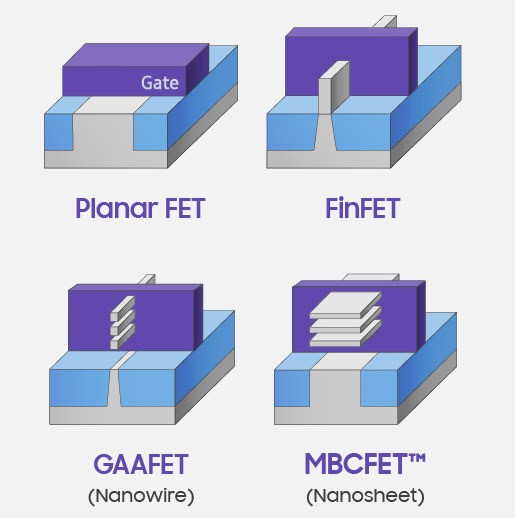
 
根据IBS（International Business Strategies）的估计，3nm工艺将会需要40-50亿美金来开发制程技术，月产40,000片wafer的工厂需要150亿到200亿美金的建设费用。
https://www.extremetech.com/computing/272096-3nm-process-node

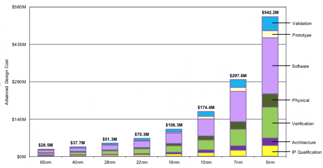

IBS进一步指出，使用5nm的客户将需要支出5亿美金来开发制程技术，而3nm的芯片开发费用将会上涨至多达15亿美金去开发例如GPU这样的高端计算芯片。随着制程技术提升，单位面积transistor密度有所提升，3nm可望达到每平方毫米300M transistor密度，但是3nm的transistor cost将会比5nm贵20-25%，带来5%左右的性能提升和15%左右的功耗降低（https://www.phonearena.com/news/tsmc-3nm-chips-will-contain-nearly-300-million-transistors-per-square-mm_id123963）。 相比之下，在7nm以上的制程中，每一代制程的引入，相同芯片设计通常带来40%的性能提升和50%面积减少，由此可见摩尔定律虽然没有停滞，但是每一代制程带来的收益已经大大减少了。

半导体市场已经出现了分化，大量的半导体公司会在28nm附近，而且因为没有使用FinFET工艺，因为其设计成本只有10M，transistor的单价也是最低的，大量对高性能和低功耗要求不高的客户将会停留在这个制程。接下来是使用FinFET工艺的16/14nm，全球只有5家foundry，包括TSMC，Samsung，UMC，GlobalFoundry，SMIC和Intel，他们主要面向高性能的CPU，GPU，FPGA，AI芯片等市场。使用EUV光刻的7nm和5nm制程只有TSMC和Samsung，他们的主要市场是手机SoC，高端CPU，GPU和AI等追求极致性能和功耗要求的应用。
从产业角度来讲，3nm主要的目标应用市场智能手机，已经连续出现了2年的市场下滑，加上全球covid19疫情的爆发，全球经济已经陷入衰退，加上美中科技脱钩带来的产业链投资碎片化，3nm技术可能会大大延后，Samsung和TSMC都延缓了3nm制程的引入时间。因为中美科技竞争导致的供应链独立，将会加剧脱离对现有的基于制程的增长模式的依赖，3-5年内随着国产替代在DUV产业将会出现大量的产能，持续降低DUV制程的成本，同时将会广泛采用开源芯片、开源EDA、3D集成，chiplet等超越性技术来构建非美的半导体设计和生产制造体系。而EUV产业长期面临高端应用不足的，从而拉长投资，放慢增长，加剧侵蚀现有的增长模式。

半导体产业发展历史上，DARPA的前瞻性的技术投资起到了很大的作用，包括投资1980年代的 MOSIS （Metal Oxide Silicon Implementation Service) 代工服务 ，开创了现代半导体foundry的服务模式，大幅度降低了半导体设计生产制造的成本，1990年代牵头产业和学术界研发了193nm光刻技术，为半导体产业近20多年的增长打下了基础，1996年当产业界还在250nm工艺的时候，DARPA敏锐的发现25nm之下摩尔定律的增长将会停止，必须要预研新的技术，对胡正明教授递交的FinFET晶体管构型做了投资，1999年FinFET论文发表（https://spectrum.ieee.org/semiconductors/design/the-origins-of-intels-new-transistor-and-its-future），直到12年后Intel首次在22nm使用了FinFET技术，避免了产业的停滞，是非常典型的规划主导型的创新，是半导体产业的第三次创新，随着半导体产业靠制程缩减芯片尺寸的创新也渐渐进入平台期，DARPA提出了电子复兴计划（Electronic Resurgence Initiative），ERI启动于2017年，为期5年，投资14亿美元，包括了政府和企业的投资，主要投资美国的大学和企业承担的技术项目。DARPA认为这是半导体产业的第四次创新，主要解决4个挑战
 *	提升未来半导体器件的性能，
 *	解决数据爆炸带来的信息处理能力问题
 *	解决高昂的芯片设计成本
 *	解决芯片设计和生产产业链的可信和安全	

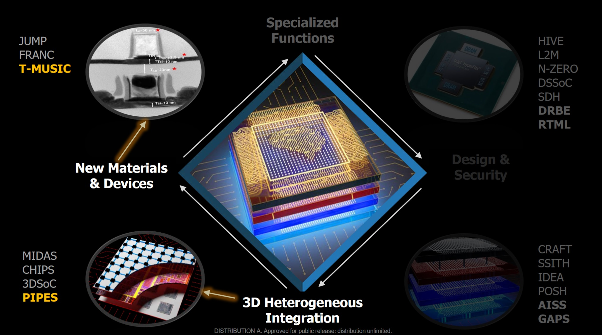

DARPA ERI 提出的这些挑战具有风向标的意义，尤其考虑到ERI项目提出的的背景，因为7nm 以上的先进制程首先满足的是民用市场，而且门槛奇高，先进制程的芯片设计价格已经不是军事应用可以承担的，先进制程的工厂集中在越来越少的厂家，而且都不在美国国内，随着芯片的软件和硬件日益复杂，供应链的全球化，如何能够保证在民用的半导体foundry制造安全可信的芯片。结合前面对半导体产业界在DUV和EUV工艺上的分野，业界大多数客户面临的挑战和DARPA ERI 有类似的地方，即当先进制程不可追求的时候，是否还有其他手段能够大幅度降低芯片设计和开发成本，大幅度提升性能。EUV产业继续延续工艺缩短是曲高和寡的第一条路线，DARPA ERI目前赞助20个项目可以看作是在现有制程技术基础上演进的第二条路线的一个技术规划，DARPA ERI项目的中最重要的使命可以归结为，**如何通过设计方法、设计工具、计算架构和制造技术的的颠覆式变革，大大降低面向领域应用的SoC芯片的开发成本、周期、制造和组装成本，并且达到整个设计和生产流程的安全和可信。同时通过政府和工业界对学校基础研究的大力投入，保障半导体产业人才的供给。ERI和半导体产业对产业未来10年的路标基本达成共识**。

如下图所示，综合ERI的布局和其他产业的规划，未来计算产业将会在体现出下面的几个特点

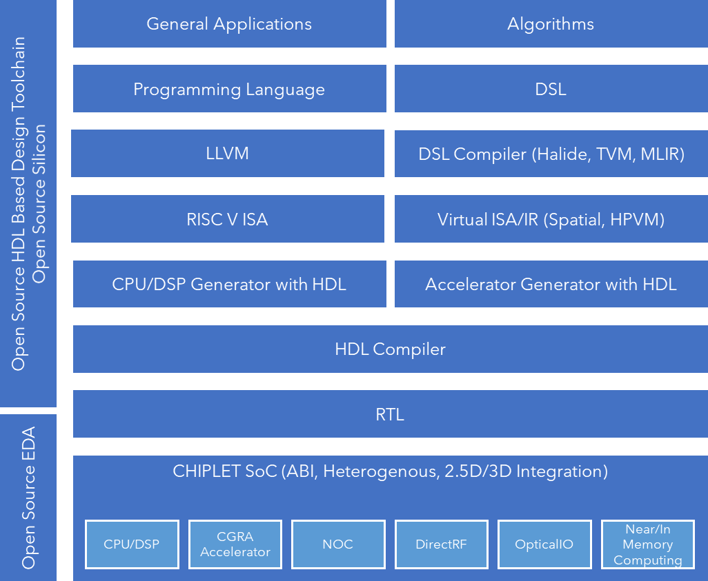

- CPU和加速器设计流程和工具全面软件化和AI化，从CAD（Computer Aided Design）变为AAD（AI Aided Design），实现从算法问题到加速器的自动化设计，大大降低DSA设计的人力和资本投入

- 基于开源将会形成类似软件领域的大型生态，包括EDA生态，DSL语言生态，开源芯片/IP生态，基于开源标准的chiplet生态，这些生态的构建布局将会是产业争夺主导权的重点，结合供应链可能形成不同的产业联盟

 - 围绕标准化chiplet接口标准和异构集成技术，建立一个chiplet 产业生态系统， DAPAR的目标是能够降低70%的芯片设计和NRE投入，减少70%芯片投片时间，而在芯片计算和带宽能效比上达到单一工艺芯片（monolithic）芯片的水平。在IDM 模式和Fabless模式之外，出现了第三者系统集成商模式，系统集成商主要利用货架化的chiplet，在封装工厂来制造最后的芯片系统。

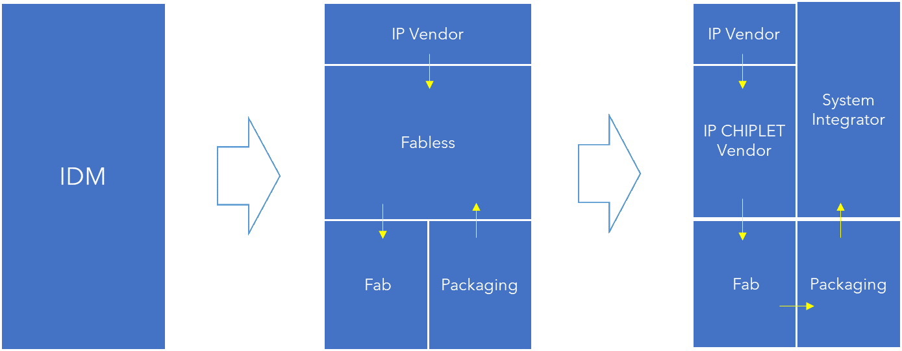

- 云计算、AI平台公司将会利用芯片产业的结构性变化成为重要的产业推动力量

下面主要总结一下ERI在DSL/DSA，EDA和Chiplet领域的技术布局。

## 1、	针对domain specific问题的计算机体系架构，相比通用处理器1000x的功效提升

为domain specific应用建立一个从DSL到DSA的端到端的方法和工具，降低domain specific应用的开发和应用成本，加快创新速度。典型的领域应用包括图计算、软件定义的无线电，深度学习和ML，特点是支持TOPS的处理速度和相比通用计算100~1000倍以上的计算能效比，这也是当前计算机体系架构的热点应用领域。ERI定义了两个相关的项目，DSSoC（Domain Sepcific System on Chip）和SDH（Software Defined Hardware），DSSoC主要面向edge部署的软件定义的无线电和计算机视觉应用，通用CPU的可编程性很好，软件生态丰富，但是在处理专用场景的计算功效不高，DSP，TPU这类的专用处理器，处理专用场景的性能功效高，但是可编程能力不高。DSSOC希望寻求可编程易用性和专用性能提升之间的平衡，提供端到端的从应用到DSL编程语言到OS和runtime，直DSSoC芯片的全栈技术方案。

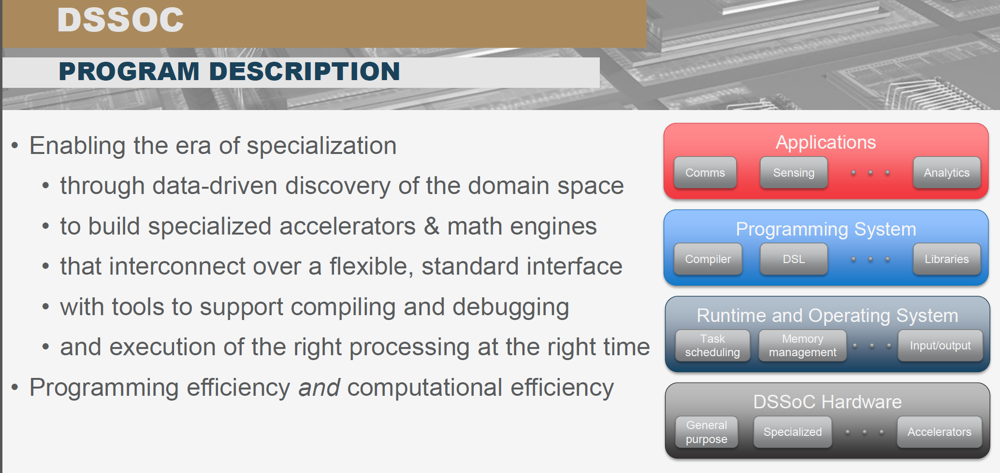

UIUC提出的HPVM定义了一个较为通用的DSL的IR和DSA的ISA，目标在于定义一个标准的DSL到DSA的标准界面，Spandex定义了具备可编程能力的加速器之间的cache可配置的数据访问接口。

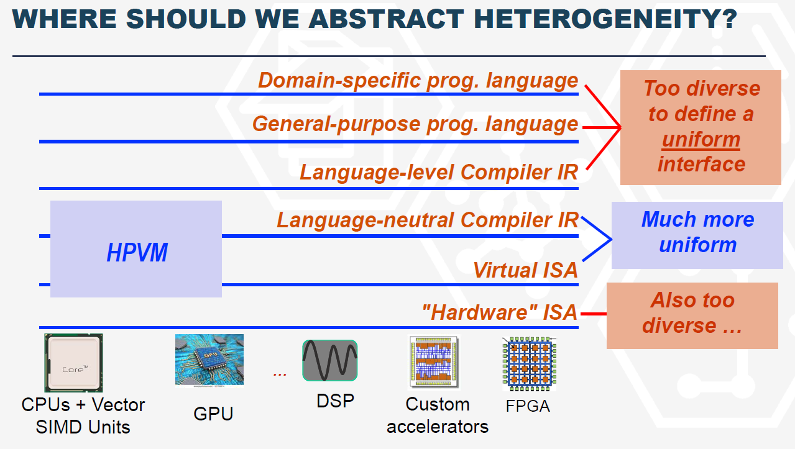

斯坦福的AHA（Agile Hardware）针对图像处理和计算机视觉使用的Halide DSL使用他们的HDL语言和accelerator实现了一个DSA加速器。

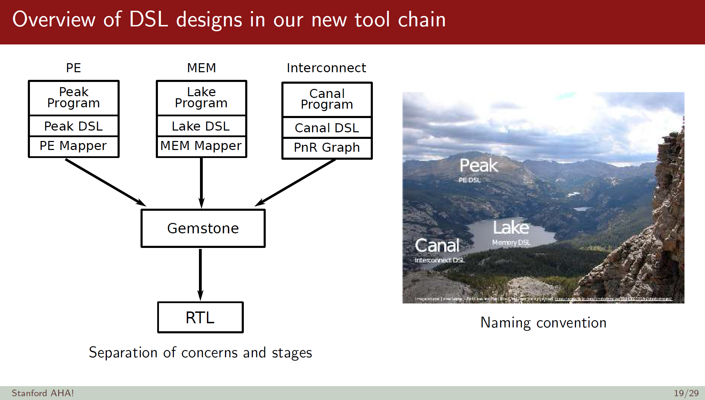

相比DSSoC，SDH（Software Defined Hardware）强调底层可编程的硬件架构，因为针对算法优化的硬件架构迥异，为每个算法开发一个芯片成本过高，可编程的FPGA性能和ASIC相比又有较大差距，SDH目标是基于粗粒度可编程阵列（Coarse Grained Reconfigurable Array ）实现对不同算法的动态重新配置。FPGA可以实现gate级别的可编程功能，属于细粒度的可编程阵列，为了支持这种细粒度的可编程能力，40%的FPGA芯片面积被用来实现gate的连接，而CGRA把编程粒度提升到了较高的算法内核的计算和内存管理层面，降低了可编程粒度，但是有效提升了计算密度和功效。比较多的CGRA架构是一个同构对称的计算和存储分片，这些分片之间通过片上网络实现高速联通，达到任何分片之间的访问，可配置的是一个计算图在CGRA资源拓扑上的映射。

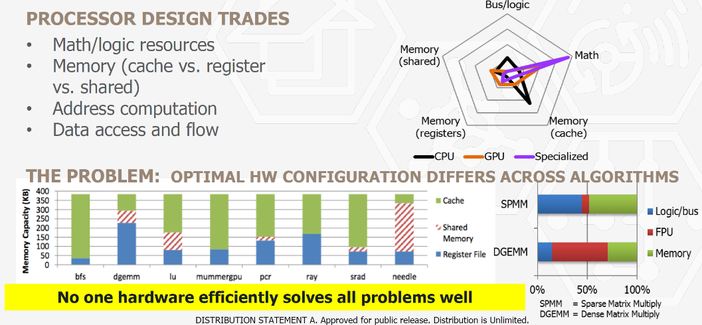

SDH终极目标是能够实现相比CPU 1000x的计算能效比和同样的软件可编程能力，硬件能够在300-1000ns内重新配置。

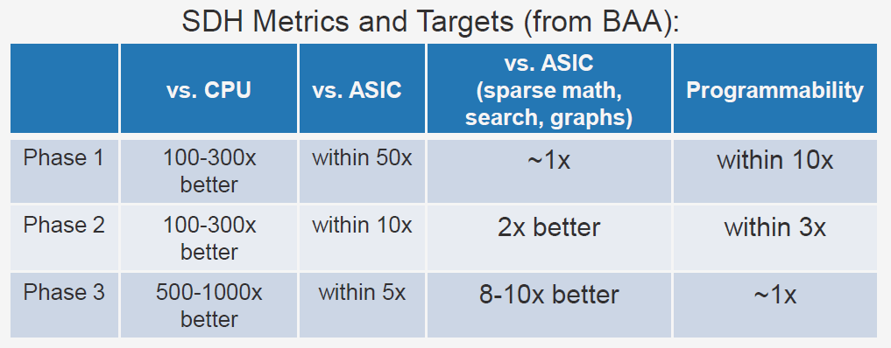

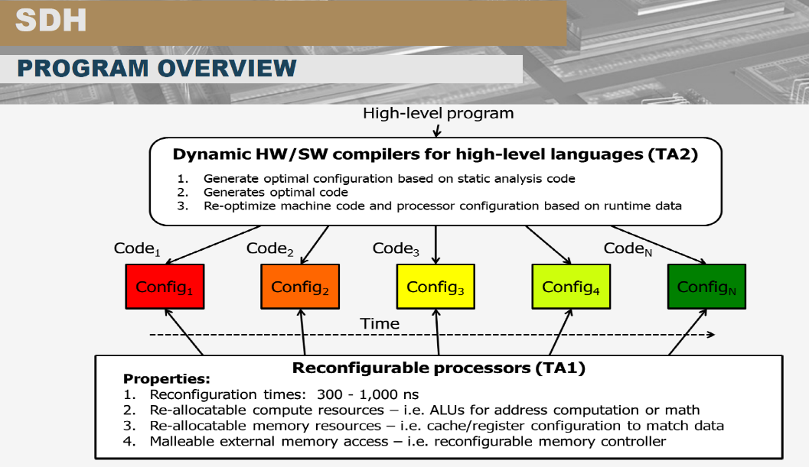

SDH项目有斯坦福并行计算实验室的Kunle Olukotun教授，他的研究小组是DSL和DSA领域的顶级团队，他们发布的Spatial 编程语言和Plasticine CGRA硬件架构完整实现了端到端的从算法问题到加速器的实现，并且Kunle教授和斯坦福的 NLP 大牛Christopher Re以及前Sun Sparc处理器的主任设计师Rodrigo Liang一起创立了SombaNova AI 芯片公司，迄今已经融资4.7亿美金，基于7nm工艺的Cardinal SN10芯片具备高达100TOPs的算力，具备training和inference的能力，直接挑战主流的GPU方案。在上百家的AI芯片创业公司中，SombaNova是不多的软件定义芯片的厂家，根据目前公开的信息他们的芯片主要基于他们论文发布的Spatial DSL和Plasticine CGRA架构（https://youtu.be/E7se0KEa4BY），这也是SDH思想的最早的商用。

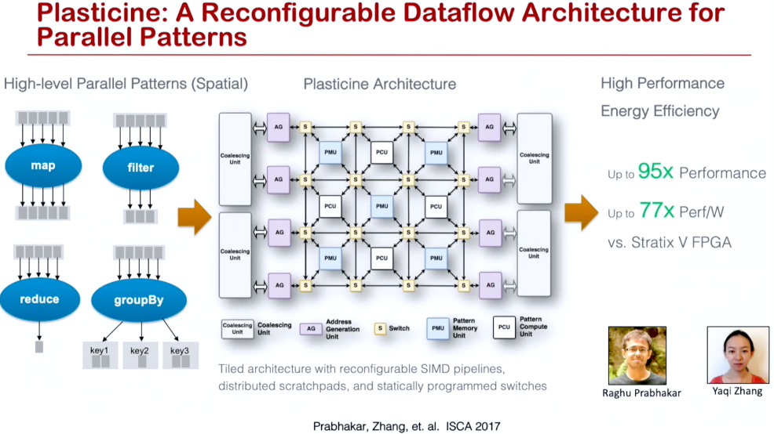

SDH另外一个项目是MIT的Saman Amarasinghe教授领导的tensor algebra processor（张量代数处理器），他的研究小组开发了很多重要的DSL语言，他的学生Jonathan Ragan-Kelley 设计的Halide 图像处理DSL已经被Google、Qualcomm采用作为其图像处理芯片的编程语言，实现了DSL从语言到芯片的闭环 （https://people.eecs.berkeley.edu/~jrk/）。Halide的设计思想也启发了几个其他非常有影响力的DSL，例如：做DL硬件编译的TVM，作为FPGA DSL的HeteroCL等。

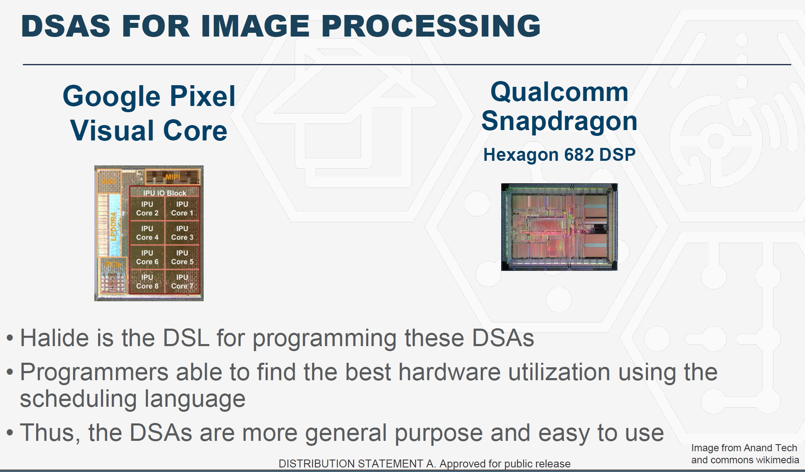

他们设计的TACO DSL是一个张量代数编译器（Tensor Algebra ）（http://tensor-compiler.org/），tensor这种多维矩阵数据结构广泛应用于ML、图计算和科学计算，为此已经存在了大量的计算模板，即所谓的kernel，但于此同时，现实世界中tensor的数据一般是是非常稀疏的，即大多数的数据都是0，如果不利用稀疏性，计算模式比较简单，例如：一个两维矩阵相乘的算法如果不考虑稀疏性只需要12行代码，但是如果要扣除矩阵中的0数据，则需要手工写100行代码。TACO设计了一种数据结构，可以只存储非0的数据，大大压缩了需要的计算和存储需求。Amazon公布了一个包括稀疏的保护所有0元素的tensor数据集，存储容量是107 exabyte，经过TACO表征之后，数据被压缩为13 gigabyte，压缩率为10M，使用TACO，tensor计算开发者可以使用简单易用的高层DSL来描述计算过程，TACO会自动产生考虑了稀疏性的计算代码，代码优化的水平达到或者超过了手工优化的水平。（http://news.mit.edu/2017/faster-big-data-analysis-tensor-algebra-1031, http://tensor-compiler.org/）。

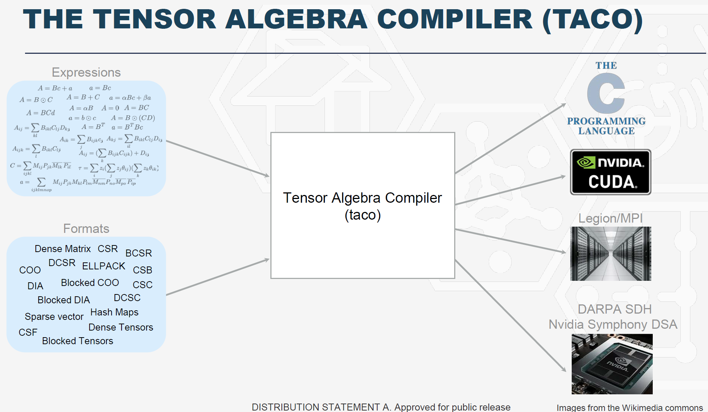

UIUC和Nvidia团队基于TACO DSL 开发了Extensor加速器（https://dl.acm.org/doi/10.1145/3352460.3358275）

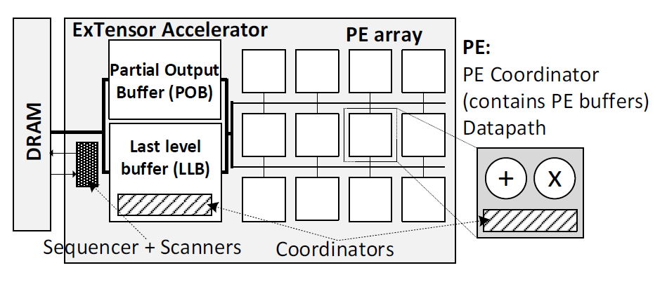

ERI项目基本涵盖了DSL和DSA领域最好的研究团队，其研究成果都已经开源，基于他们的基础研究，产业已经在跟进做商业化实现，主要应用于AI、图计算等领域。ERI设置的即有通用计算可编程的应用性，又能对domain 问题提升1000倍的计算能效比的目标一旦实现，整个计算产业都会为之改变。

## 2、	基于开源和AI的EDA设计工具和流程，借鉴软件的开发方法设计芯片，24小时无人工干预从代码到芯片实现

如前面引用的IBS的半导体制程技术投入的成本所示，当前先进制程的设计成本中软件和verification相关的投入已经占据超过一半的成本，当前的EDA流程中computer是一个辅助性的角色，工程师和专家在干主要的工作，ERI项目规划希望通过算力和AI取代人的投入，能够完成no touch情况下软件到芯片的设计全流程，这样的变革将会让芯片成为软件的一部分，任何系统软件公司都可以是一个芯片公司。项目目标是2022年达到24小时无人化的自动化从RTL代码到芯片、芯片封装和PCB板的自动化设计，而且在PPA（Performance Power and Area）上可以和商用EDA一样好。

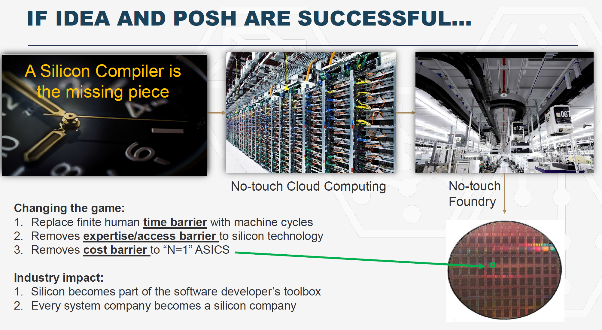

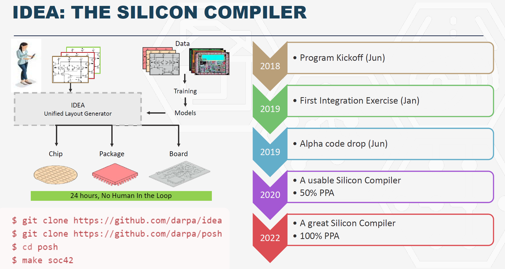

ERI在设计领域主要有IDEA，POSH，CRAFT项目，IDEA项目投资在64.5M美元，构建一个基于开源软件和AI构建一个完整的数字和模拟自动化IC设计的工具链，POSH项目35.5M，旨在构建一个开源IP库，两个项目包括了11个洲的22个团队，团队包括了大学、公司和全职专家。

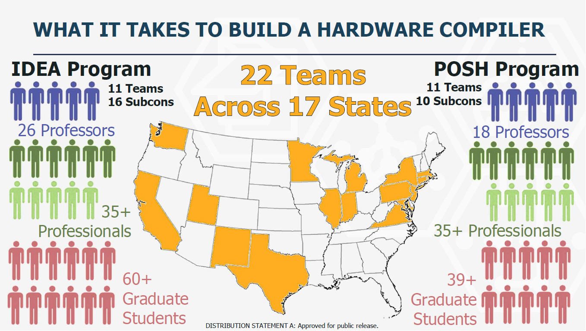

IDEA比较重要的一个项目是UCSD Andrew Kahng教授牵头的openroad project(https://theopenroadproject.org/)，这是一个开源的完整的从RTL到GDSII芯片tapout文件的芯片后端设计和仿真工具集。除了开源，这个项目将会探索两个核心技术，一个是基于对问题的极限分割（extreme partitioning）从而可以通过云计算的进行并行优化，另一个是基于ML 数据驱动方法来建模和评价流程输出结果可以自动化调优。为了验证这个工具，将会和Michigan大学的RISC V 设计项目团队合作，基于设计团队的反馈来快速迭代这个项目的可用性和质量。2020年7月openroad 1.0版本会正式发布，Michigan大学的团队会用这个工具在TSMC 65nm工艺流片。然后版本会继续演进到高阶制程。

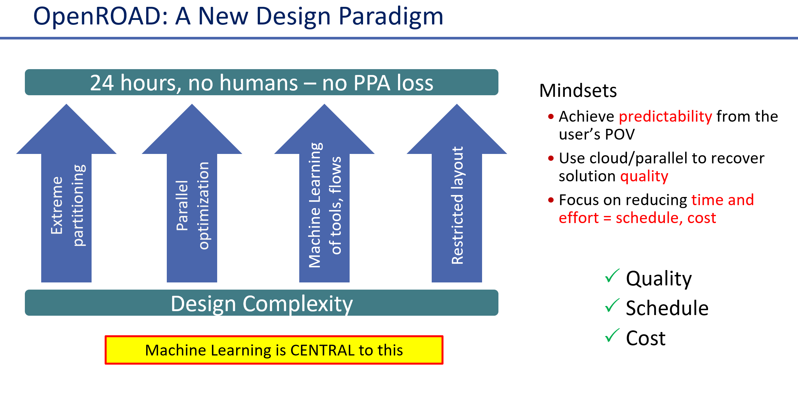

Openroad项目的核心是Andrew教授团队开发的布局工具RePlAce，这个工具属于当前EDA业界最好的placement工具之一。

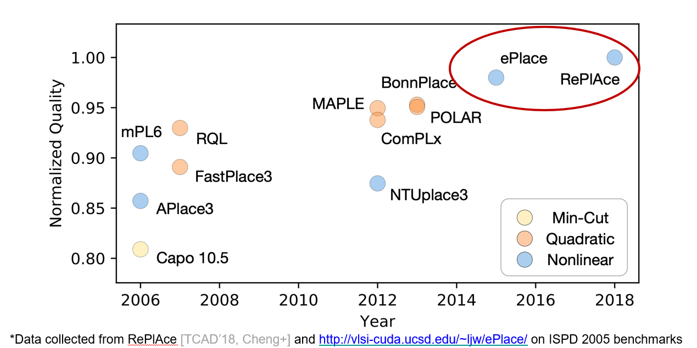

有意思的是，google团队最近发表的使用reinforcement learning做TPU芯片的后端布局设计（https://arxiv.org/abs/2004.10746），有一个和RePlAce的比较，从结果来看google的方法比RePlAce要好。Andrew教授从事EDA研究20多年了，google团队的第一和第二作者是初出茅庐的年轻AI PhD ，当然google的方法还缺乏更多的细节和实践，这样的比较不是很公平，但是也显示出了数据驱动的AI技术对EDA产业的核心算法已经产生了超越的可能性。

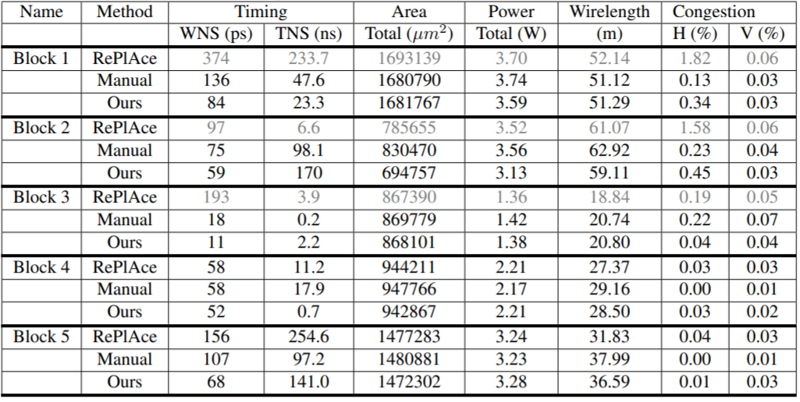

同时，IEEE CEDA Design Automation Technical Committee (DATC)开发了一个EDA的开放参考设计流程，DATC Robust Design Flow，支持完整的从RTL到GDS的设计流程，这个流程上的工具可以被替换以评价性能，对于EDA研究和研究到工业界的转换非常有用，Openroad项目补全了RDF 2018版本缺失的流程，成为了RDF 2019版本的一部分（https://vlsicad.ucsd.edu/Publications/Conferences/373/c373.pdf），这样DATC RDF工具已经成为一个可用性非常好的EDA参考工具，DATC经常性的举办算法比赛，未来获胜的算法都可以被集成到这个RDF，极大便利了研究人员做性能比较，同时这些好的算法（开源或者闭源）可以不断补充到openroad项目中，用户可以根据自己的需求混搭自己的算法。另外，RDF还会建立一个数据库，记录通过RDF流程验证过的制程库，更增加了openroad的实用性。

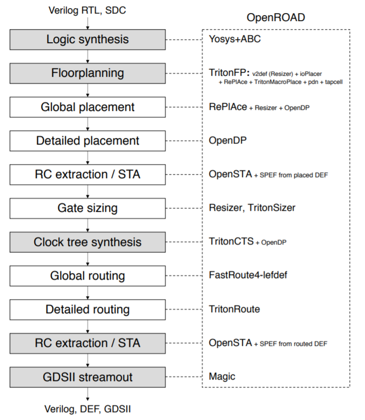

IDEA最大的投资授予了cadence的MAJESTIC项目，共$24M，研究基于DL和ML的数据驱动芯片packaging和PCB布局和布线技术，最终这些技术融合进入Cadence的OribitIO工具。

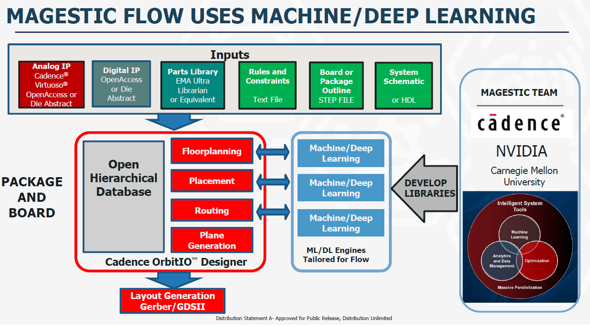

POSH项目旨在仿照开源软件生态，构建一个开源的IP库。开源IP库不仅可以像开源软件生态一样催生出更多高质量的创新，同时开源带来了可信和安全，因为在源代码上做verification会更容易更全面。

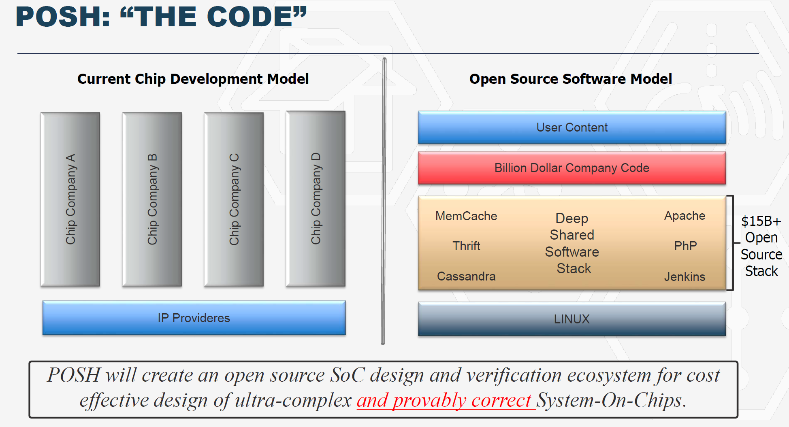

CRAFT项目解决的是在高端制程快速定制芯片的问题， 高端的SoC芯片除了后端制程投入很高，前端设计的成本也在不断攀升。2018年nvidia发布了针对车载AI的Xavier芯片，使用TSMC 7nm制程，总共投入了8000人年的工作量，价值20亿美金。

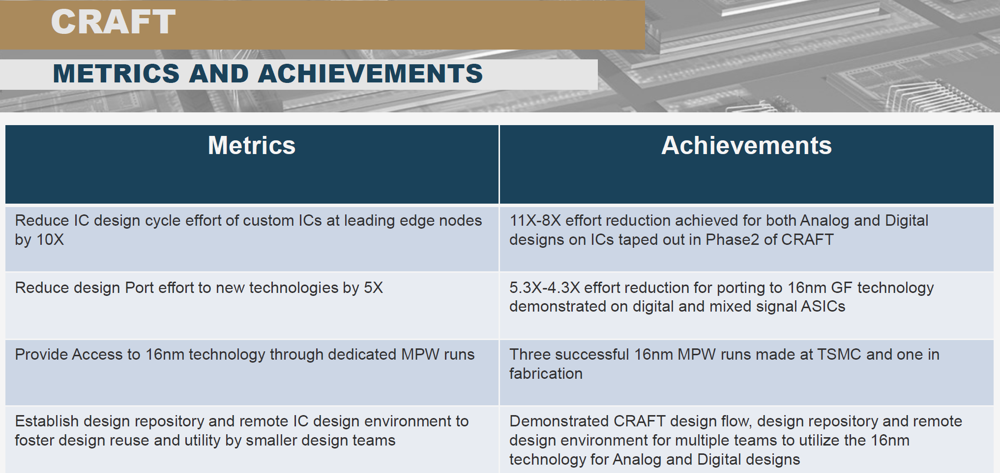

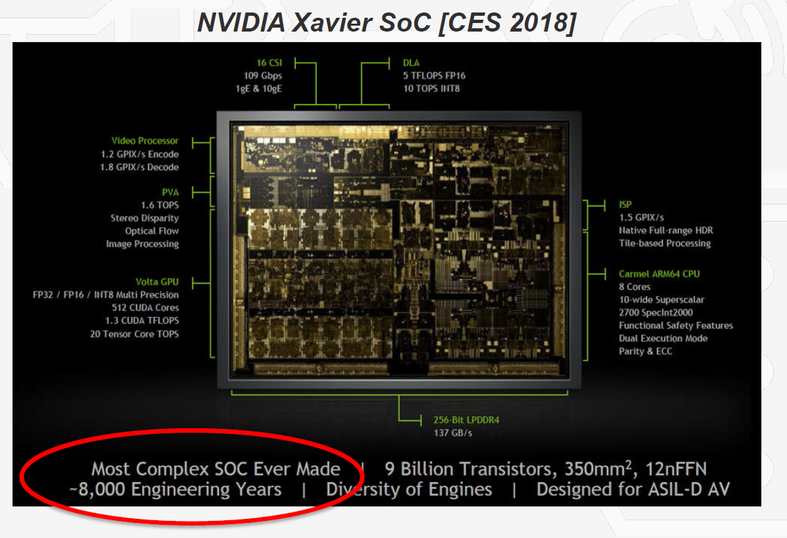

CRAFT是投资比较早的项目，主要的成果是 UC Berkeley Aspire和ADEPT实验室以David Patterson代表的研究小组开发的RISC V 开源ISA和开源芯片，以及相关的Chisel 高级硬件描述语言，硬件编译器和相关的verification等工具项目。Chisel是描述数字逻辑的DSL，FIRRTL是编译器的IR标准，这两个项目已经毫无疑问成为业界前端逻辑设计的首选，已经进入了Linux Foundation的Chips Alliance项目，获得了长期稳定的社区支持。基于Chisel和RISC V，伯克利ADEPT Lab已经建立起一个比较完整的前端芯片设计开发研制流程和生态，称为chipyard（https://github.com/ucb-bar/chipyard），包含了RISC V，DSP，DL加速器等经过流片考验的generator（设计模板）。基本实现了David Patterson提出的agile hardware design的方法。

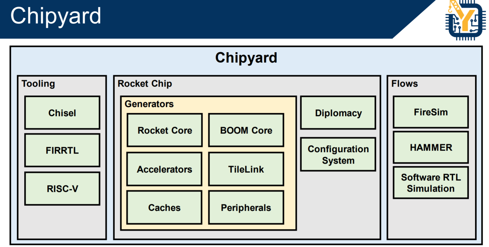

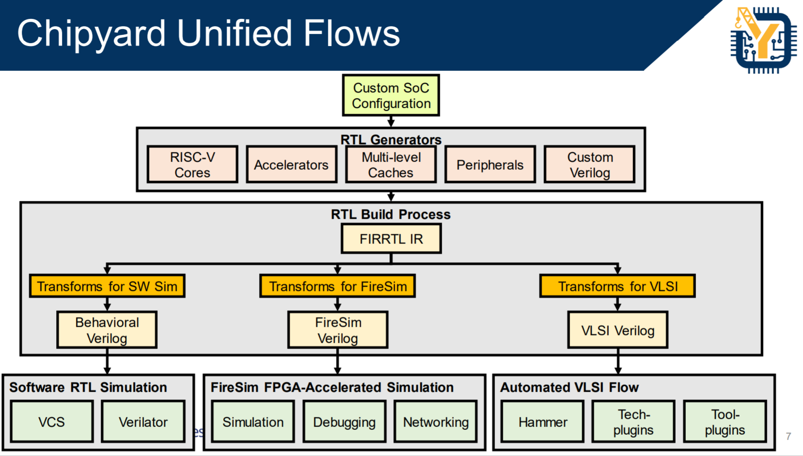

## 3、建立chiplet产业联盟，实现低成本小规模芯片的快速创新，通过使用3D堆叠和新型半导体材料实现落后工艺对先进工艺的反超

ERI项目的核心目标是在先进制程变得越来越昂贵的情况下，探索可以使用其他技术手段大大降低芯片设计和制造成本提升性能。前面的DSA技术、开源EDA技术，开源IP，都为这一目的服务。在SoC设计中IP的重用是非常重要的降低设计成本，提升设计质量的方法，SoC产业已经建立了一个庞大的IP生态。但是传统的IP模式，只实现了设计阶段的IP重用，即使对已经被集成和生产过的很成熟的IP，SoC设计公司每一个新芯片仍然需要做重复性集成和验证工作，在芯片生产的时候，也需要支付相应制程的NRE成本。

Common Heterogeneous Integration and IP Reuse Strategies (CHIPS) 项目旨在构建一个更彻底和经济的IP重用机制。如下图所示（https://www.intrinsix.com/blog/the-impending-hsoc-revolution-potential-solutions-to-the-asic-cost-barrier），基于chiplet实现的IP重用可以节省设计验证和流片的成本，以chiplet方式设计芯片，就相当于设计一个基于PCB的硬件板卡，大量的货架性的元器件都可以买来集成，用户只需要关注系统功能的达成，设计的成本和质量保证工作都分摊给了元器件厂家，除了chiplet集成的密度更高，两者的经济学原理是完全一样的。

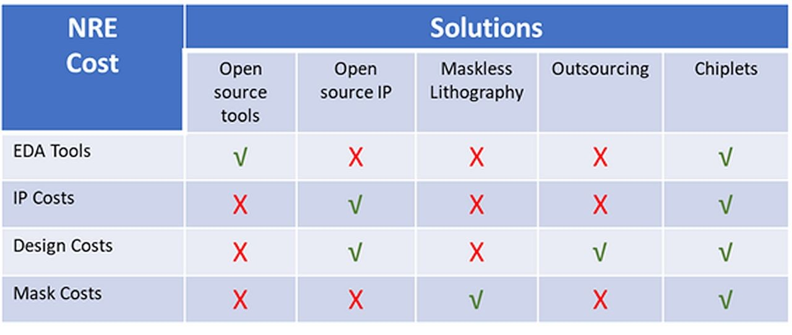

chiplet技术解决的另外一个成本问题是异构技术的集成。现代的SoC已经可以把memory、逻辑器件、高速数模混合功能器件等集成在一个die上，但是随着先进制程的发展，这种monolithic集成的方式并不带来很好的经济性，越来越少的设计能够利用7nm以上制程工艺带来的好处，例如：可以充分并行化处理的GPU，加速器等，高端制程不断降低的rail voltage对模拟器件要求的信噪比是一个巨大的挑战，同样I/O互联功能在高端制程上获得的收益也有限。下图是AMD 发布的基于chiplet实现的CPU路标，其中I/O die是12nm实现，为服务器和终端计算市场又不同的设计，CPU die是7nm工艺，最终的芯片按照不同的市场来组合I/O die和CPU die，不同的功能单元使用最适合其工艺制程的技术实现，达成了相比monolithic设计更好的性价比。

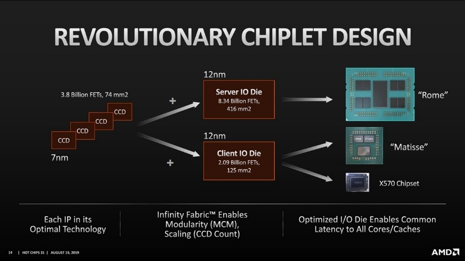

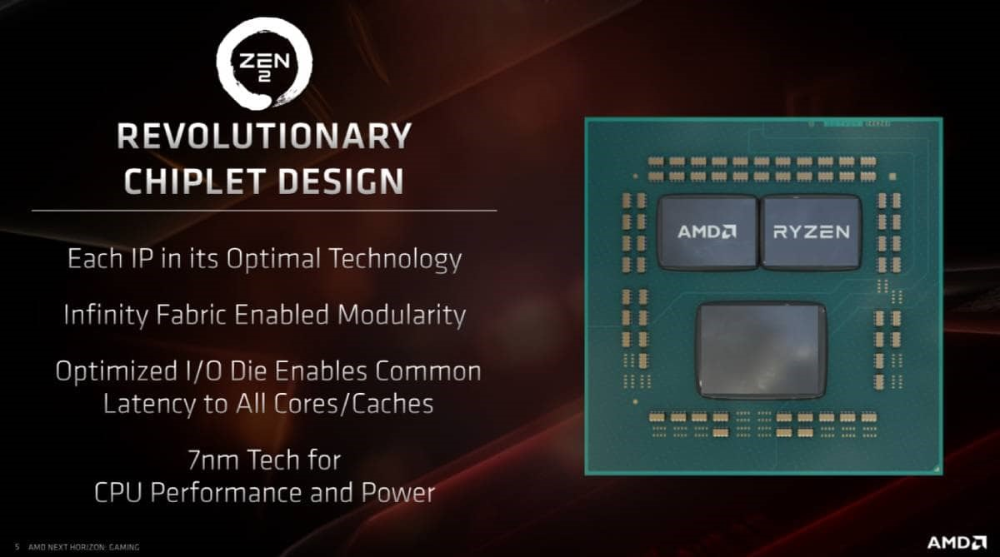

chiplet还有一个优势是提高了芯片的良率，同样制程工艺下，良率和die的面积成反比，die面积越大上面的晶体管越多，同样的defect概率下，面积大的die损坏的概率越大。AMD测算过，使用chiplet集成的芯片，相比monolithic设计付出了10%的芯片面积用于实现chiplet的互联等逻辑，但是换取了良率的提升。

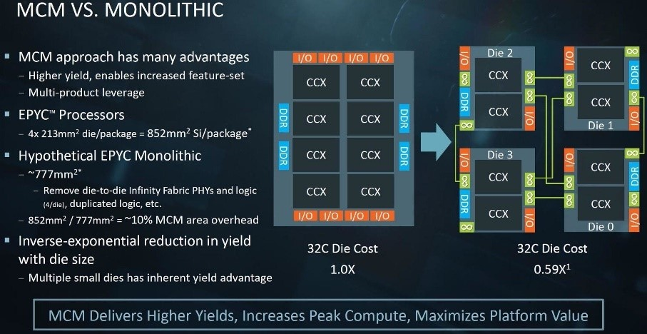

CHIPS项目的主要目的是通过标准化chiplet互联协议建立一个chiplet生态，集成的工艺线宽在10um到100nm之间，可以集成的技术包括了内存、计算、加速器、模拟射频和硅光器件。

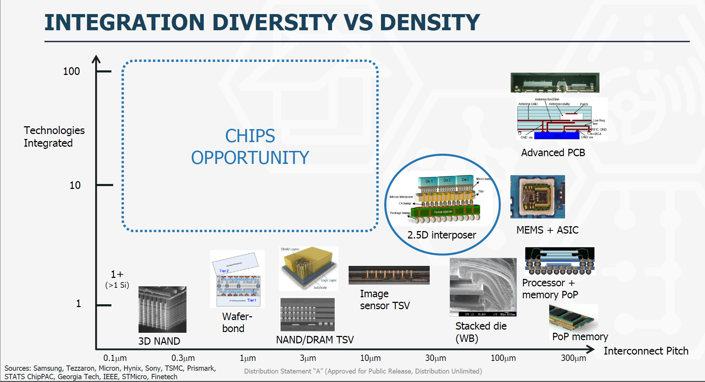

基于这个生态构建原型芯片，目标是验证基于chiplet设计实现的SoC和传统monolithic SoC的计算效能接近，下图是CHIPS的项目路标，2022年项目结束的时候，用于验证的SoC可以使用50%以上事先制造好的chiplet，芯片的NRE投入降低70%，芯片投片时间减少70%，同时强调异构集成要能够使用三种以上不同技术的IP。为此目标提出的chiplet互联标准，数字接口要求能够达到1pj/bit的能效比，1Tbps/mm的连接密度，延时要求小于5ns。

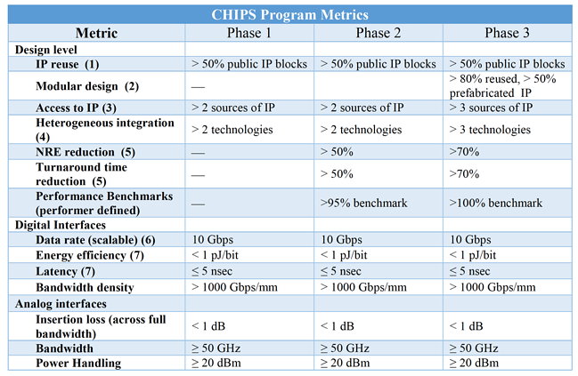

基于TSV的3D堆叠和基于2.5D的interposer技术已经在高端高密度SoC，高性能CPU和FPGA产品上广泛使用，是高端SoC厂家和foundry合作作为差异化竞争的工具，业界并没有形成统一的标准。竞争chiplet互联协议有三种技术，基于并行互联的BoW（bunch of wire）技术，例如：HBM 内存的连接和intel的AIB技术， ultra-short reach (USR) serial技术，和传统的SerDes技术。SerDes有很成熟的生态，但是功耗和连接密度都难以满足chiplet集成需要达到monolithic芯片能效比的目标。USR介于SerDes和BoW技术之间，增加了新标准带来的复杂性但是又不提供足够好的性能，目前业界对BoW接受度比较高，包括Open Compute的ODSA（Open Domain Specific Architecture）也选择BoW风格的互联标准来做chiplet集成。

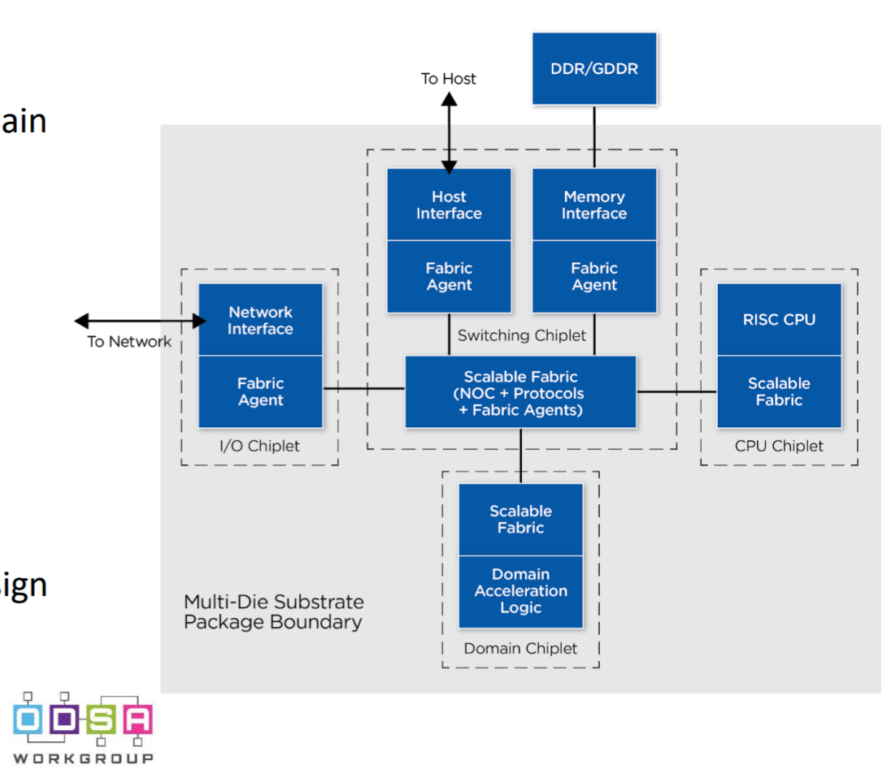

CHIPS项目的一个主要成果是促使Intel开源了其AIB chiplet互联标准，并且放弃了专利索取，可以免费使用，这是chiplet生态的基础。AIB技术本身已经达到了CHIPS项目三期的技术指标，满足了单位面积连接带宽高于1Tbps，和延时小于5ns的需求。

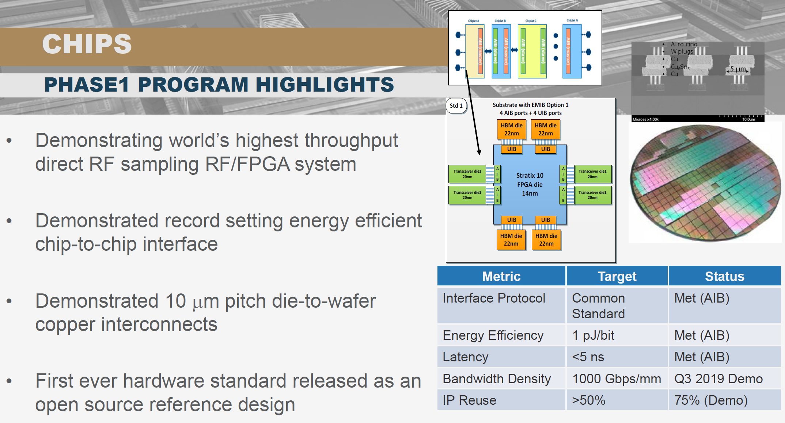

评估连接效能可以使用品质因数（Interconnect Figure of Merit），即每平方毫米提高的连接带宽和每bit消耗能量的比值，品质因数越大效能越高。按照Intel的AIB测算，其品质因数比PCB板级连接协议PCIe相比高10000倍，延时降低100倍。

在DARPA CHIPS建立的以美国厂家为主的chiplet生态之外，Intel 已经把AIB项目捐献给了Linux foundation的CHIPS Alliance，进入了主流开源软件的发展模式。但是标准的争夺并未结束，竞争对手之间是否会支持统一的互联标准，例如：AMD 有自己的infinity fabric协议，产业链的分化是否会形成不同的互联阵营。chiplet互联协议还需要和JEDC等标准组织互通。

chiplet技术将会在数据中心领域、高性能无线基站、移动SoC这些领域继续高速发展。下图是ODSA的一个计算架构参考图，建立了一个基于intra chip的chiplet互联和inter chip板级互联的一个全景图。

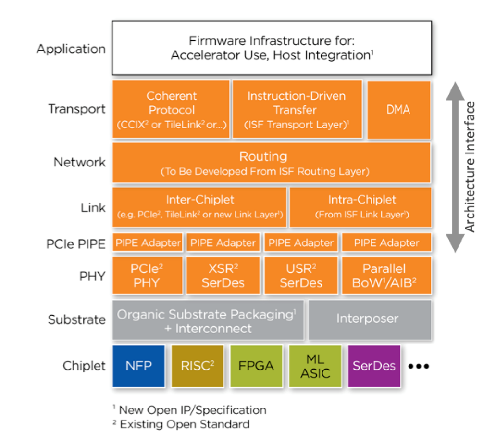

最近UIUC和UCLA的研究人员使用Silicon interposer fabric 技术做了一个40GPU的wafer scale computing（http://passat.crhc.illinois.edu/hpca19_cam.pdf），研究表面在300mm的wafer上集成40个GPU是可行的实现，这种集成方式没有改变用户编程的方式，透明加速了应用，仿真结果表面，相比40个通过PCB板集成的GPU，wafer scale GPU 可以提升5-25倍的带宽，提升20倍左右的性能。整个系统的功耗高达2000瓦。

去年cerabras 发布了其wafer scale的AI芯片（https://www.cerebras.net/），业界质质疑较多的是怎么处理良率问题，cerabras声称可以通过软件方式绕过有缺陷的计算和存储单元。相比之下，UIUC的这个通过chiplet实现的wafer scale computing在良率上明显要好，而且根据业务的不同可以灵活配置wafer上的计算和存储单元，而且属于制程技术的scale，不需要软件修改就可以提升性能，相当于延伸了摩尔定律。为了基于chiplet实现的wafer scale computing在AI training等需要大规模并行化运算的场合会有应用的机会。

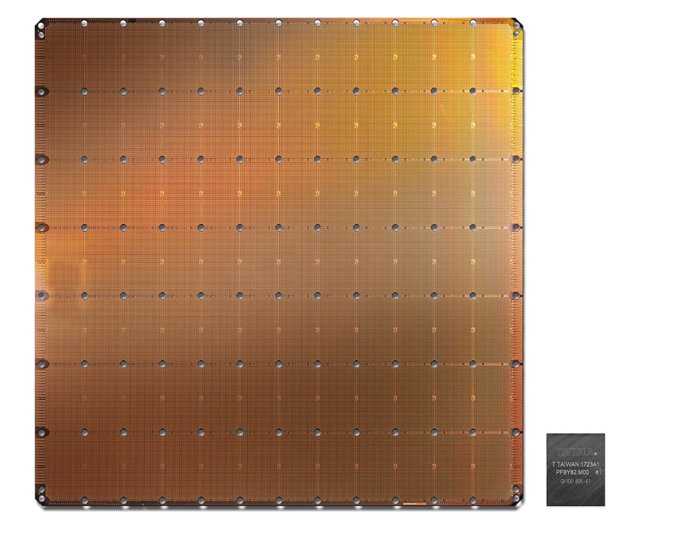

除了CHIPS项目之外，DARPA的3DSoC项目探索如何通过使用新器件和材料堆叠3D结构的芯片，目标是使用90nm的工艺达到7nm制程的计算能效比，这条思路如果能走通，进一步降低了高端制程的经济性，因为高端制程的主要优势是计算的能效比。制约计算能效比的一个主要因素是计算单元和内存之间的连接数量和功耗，连接越多，连接距离越短，耗费在数据传输上的能量开销就越少。3DSoC目标是提供9M/平方毫米的连接密度，45Tbps的带宽，内存访问的能耗低于2pj/bit。同时在制程工艺上要求达到30%以上的良率，配套的EDA工具要支持500M门电路和4GB内存的设计。

主要承接方是MIT的Max Shulaker教授。3D IC已经出现在高端的AI和移动SoC芯片中，HBM内存就是通过3D堆叠方式提供低延时大带宽的内存访问，制约3D IC进一步发展的主要因素是硅工艺的集成温度在1000摄氏度以上，堆叠层数过多的时候热效应会影响已经堆叠好的层。

所以提高3DSoC集成层数的关键是降低材料的集成温度，为此这个项目使用RRAM（Resistive RAM）和CNTFED（carbon nanotube field-effect transistor），这两个器件的集成温度都在200摄氏度之下，很合适做多层堆叠。最终实现的3DSoC包括4层，两层CNTFED实现的计算层，一层CNTFED实现的SRAM存，一层RRAM实现的4GB内存，这也是目前全球密度最高的RRAM和CNTFED设计。

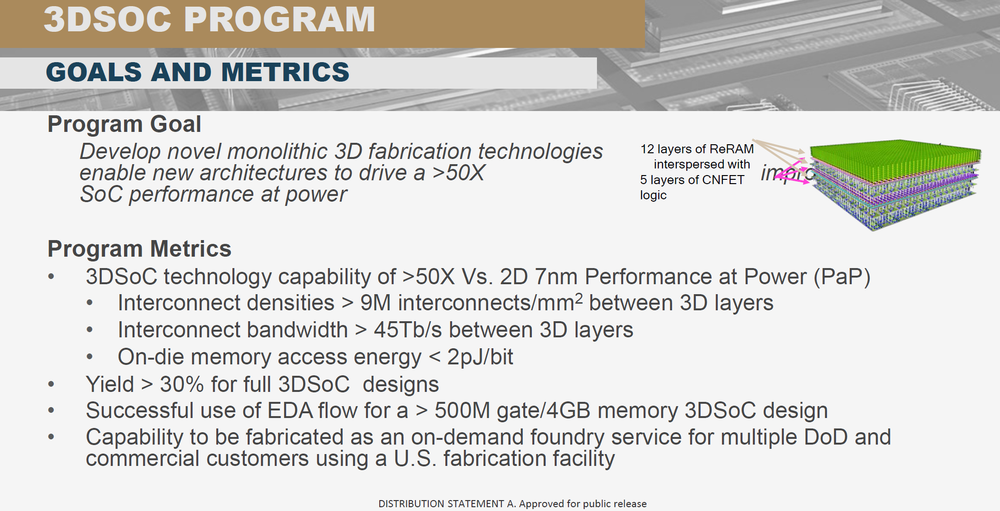

chiplet和3DSoC项目验证了延伸摩尔定律的其他路径，其生态如果逐渐构建起来，将会发生结构性的产业变革，对先进制程的需求会降低，创新的重点回到了packaging集成，这对产业是有利的。

## 4、	摩尔定律的第二路径满足了互联网和云计算公司对算力功效的追求，软件公司都成为芯片公司的趋势对这些公司最为有利，他们将会成为塑造半导体产业未来的重要力量

芯片设计的软件化和AI化，对传统的fabless公司是一个巨大的转型挑战，而对云计算和互联网公司这种变化是符合他们的人力素质模型和软件文化的，事实上这种变化的源头就是芯片产业主动学习软件产业从而可以更加快速、灵活和高效。另一方面，互联网公司和云计算公司对廉价算力和计算效率的追求是无止境的，在摩尔定律对通用计算基本停滞的情况下，互联网公司根据业务需求来做定制化芯片也有巨大的优势，因为他们拥有大量的应用负载数据，内部的软件自研比例很高，很容易重新把代码编译到新的计算平台，例如：Google、阿里等公司使用自研的AI加速芯片的导入速度很快，而大量的AI芯片创业公司却还在寻找用户、为用户移植应用的征途上挣扎。云计算公司因为聚合了大量客户的计算需求，也可以从这些需求中找到大颗粒的特定运算负载用定制芯片加速，Amazon收购Annapurna Labs之后不断在用定制芯片替换通用CPU，Microsoft也有自己的基于fpga的brainwave加速方案。而ERI规划的这些摩尔定律第二路径技术会加速互联网和运算公司进入定制芯片领域，从而反过来加速了这个技术路径落地的速度。这是一场技术、商业和产业链的大变革，对大多数公司而言也许是一件好事，打破旧世界的锁链才会迎来新世界。

-----
未注明引用源的材料来自 https://eri-summit.darpa.mil/2019-archive-keynote-slides

