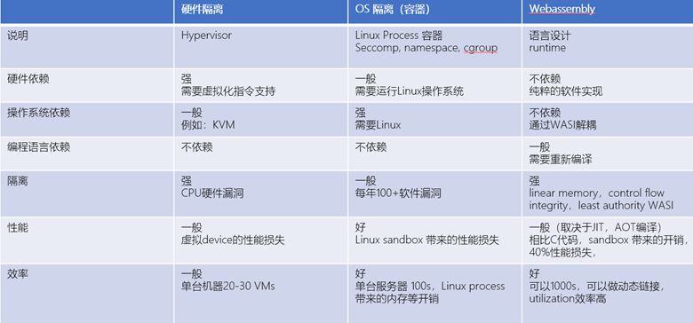

## WASM标准和应用实现实现良性循环

WASM 的spec自2019年底在W3C批准之后，WASM 在最近一年获得了很多进展，一方面是WASM的编译器和runtime领域，出现了多于10个以上的开源项目，另一方面是WASM在终端，云计算和边缘计算领域的探索性应用，比如使用wasm作为container的替代做serverless，比如WASM runtime和k8s生态的对接。这些实践活动又对WASM的特性提出了要求，反馈回到标准组织，提出了大量的proposals，形成了良好的反馈循环，推动wasm技术在各领域的成熟。

## WASM作为一种软件虚拟化技术
WASM提出的初衷是要在浏览器内安全运行第三方提供的代码，要满足安全，可移植和高性能的需求。而WASM的这些特性，在non-web场景下，相比其他的虚拟化技术，也有提供了很多优势。
WASM实现了一个虚拟计算机，核心是这个计算机的堆栈模型，内存模型，数据结构，指令结构，底层汇编语言和byte code格式等，在此之上，还有对底层POSIX操作系统API的抽象，这样WASM可以和操作系统解耦，还有和其他编程语言集成的ABI接口，数据类型转换标准等，便于其他语言可以很方便集成WASM编写的模块。这样WASM就名副其实构成了一个虚拟计算机，实现了在不同操作系统，不同编程语言环境，不同的CPU架构上的透明安全运行。这种可移植性（portable）是WASM相比其他虚拟化技术的一个最大的优势。
下图对硬件虚拟化技术，基于OS的虚拟化技术和WASM虚拟化技术做了简单的比较，值得注意的是WASM如果作为一种虚拟化技术使用，还依赖底层OS层面的支持，例如对系统服务的访问隔离等，所以这种比较更多是概念性的。

在比较计算平台的时候，学术界有所谓的PIE理论，即计算的performance，isolation和efficiency只能选择优化其中2个属性，如上表，硬件隔离性具备很好的隔离性，多核服务器通过虚拟化技术可以实现更好的利用率，但是带来20-30%的性能损失，Linux容器基于OS做运行环境和系统资源隔离，受制于Linux内核的安全性局限性，无法提供匹配硬件隔离技术的安全性，但是在使用效率和性能方面获得了优势。WASM通过线性内存，控制流完整性（CFI），指令和数据内存分离，实现了基于纯软件技术的隔离，由此也带来了较大的性能损失，但是在隔离性和效率上获得了更好的表现。

同时， WASM在实现层面也有很大灵活性，可以选择优化PIE指标中的两种，这是基于硬件和OS虚拟化难以实现的。WASM是一个由w3c牵头的工业标准，w3c只定义这个虚拟计算机的specification，保证基于这个specification设计出来的wasm计算机可以彼此兼容，在不同的场景下，用户可以选择实现自己的编译器，runtime和与应用场景结合的某些裁剪和定制。比如WASM的sandbox的内存边界检查对性能影响较大，在有些不需要运行第三方代码的场景，可以采用弱化的边界检查来提升性能（https://github.com/gwsystems/aWsm）。
未来也可以把内存边界检查功能通过硬件实现，通过软件和硬件的协同设计提升性能。再比如，WASM作为serverless虚拟化方案，还需要通过OS层实现对系统资源的隔离和虚拟化，但是WASM+container组合使用会带来不必要的开销，所以有的WASM方案在WASI层结合Linux的内核能力实现系统资源隔离，而不需要使用另一层容器（https://github.com/faasm/faasm）。

## 一般应用
WASM作为被广泛采纳的语言标准，在几乎所有的CPU和操作系统上都有其编译系统和runtime，以wasm byte code分发的代码因此具有development once, run everywhere的特性。另一方面，LLVM，cranelift，V8等编译器已经把WASM作为后端平台，C/C++，Rust，Javascript，Python，Go等语言到WASM的编译项目进展也很快，WASM具备成为universal代码分发方式的潜力，比Java当初的跨平台承诺更加雄伟。
从性能角度，在WASM最初的场景定义中，主要支持C/C++和Rust编译为WASM的代码在浏览器中运行，C/C++到WASM首先实现了很高的编译性能，据测算在关闭内存越界检查等安全特性之后，WASM的代码可以达到95% C/C++直接编译的性能，C/C++以WASM方式运行可以获得比动态语言高的性能，同时具备很高的安全性，这样C/C++语言的代码资产可以通过WASM获得更多的应用场景。现实世界中，还有大量C/C++代码实现的软件，尤其在重要的基础设施领域，例如：操作系统，中间件，关键应用领域， WASM提供给C/C++代码一个安全的sandbox运行环境，加固了代码的安全特性。新兴的Rust语言将会逐步取代C/C++的一些应用，但是Rust的安全来自编译器，Rust并没有一个sandbox设计，WASM是Rust应用的一个非常好的sandbox，这样Rust的静态安全加上WASM提供的运行时安全将会进一步增强采用Rust开发的基础软件的安全性。
对于使用GC的动态语言，WASM通过使用interpreter，AOT，JIT等编译技术提供更好的性能和更广泛的运行环境，支持WASM的计算平台就可以支持动态语言运行。WASM本身在考虑支持GC，同时也有其他巧妙使用JIT编译器的方式来把动态语言的编译器以WASM方式运行，例如：bytecode alliance提出了一种以WASM运行Javascript JIT编译器的技术（https://bytecodealliance.org/articles/making-javascript-run-fast-on-webassembly）。

随着WASM的标准化和在浏览器环境的完善支持，bytecode alliance，wasmer等non-web WASM项目的进展，开源社区已经探索出很多WASM的use cases。

## 面向消费者的应用
在面向消费者应用的领域，加入WASM的支持使得浏览器又获得了新生。前文已经对这个趋势做了分析（https://github.com/mistyminds/mistyminds/blob/master/_posts/2020-09-10-%E8%B7%A8%E5%B9%B3%E5%8F%B0%E5%BA%94%E7%94%A8%E5%BC%80%E5%8F%91%E8%B6%8B%E5%8A%BF%E5%92%8CWebassembly%E5%B8%A6%E6%9D%A5%E7%9A%84%E5%8F%98%E5%8C%96.md）

简单总结如下

### 浏览器web app
在浏览器中通过WASM实现计算密集模块，也可以构建更精简的GUI能力，运行具备桌面性能的大型应用，例如：autodesk studio
### 跨平台分发的游戏平台
可以通过WASM运行基于C/C++的游戏引擎，通过浏览器以web app方式分发游戏。Unity这样的游戏引擎有自己的跨平台runtime实现跨平台的分发，这也是unity的一大优势，但是相比WASM，其性能和开放性都有局限性。WASM出现降低了游戏平台跨平台分发的技术门槛，有利于新的游戏平台和unity竞争。
### 跨平台的app平台
基于HTML/CSS渲染能力的web app和原生app的差距主要体现在2D渲染能力上，WASM允许构建一套不依赖于HTML/CSS的渲染管线和GUI框架，例如：Skia可以移植到WASM中运行，带来桌面级的2D图形性能。Google的flutter  engine基于Skia图形库构建了一套可以跨桌面，移动和web浏览器的统一UI框架，真正实现了在mobile和浏览器上的统一图形库，实现了具备一致体验的跨平台App。
### 小程序
以微信+微信小程序代表的super app生态的崛起，带来了在App中内嵌第三方App的需求，当前的小程序基本基于浏览器web app方式开发，浏览器主要提供了安全运行sandbox，和基于HTML/CSS的渲染能力，缺点是浏览器本身很庞大，性能也不高，小程序难以运行带媒体业务这样计算密集业务。基于WASM可以构建跨平台的小程序框架，可以直接和super app集成，安全高效运行第三方的业务，尤其是AR/VR和游戏类的计算密集型的小程序。

## 面向云计算的应用场景
WASM是可以和container对标的一种软件隔离技术，但是因为WASM并不一定使用Linux的process作为基本隔离手段，所以相比container，WASM对内存和CPU资源的占用要少很多，在同样的计算平台上可以实现更高的计算密度，在很多企业私有FaaS应用中，并不需要运行不被信任的第三方代码，对隔离的要求比较低，WASM可以替代container使用，达到更高的计算密度和更快的启动速度。

在UC Berkeley的下一代stateful serverless computing架构中（https://hydro-project.github.io/），
通过引入了可从单机多核扩展到云端多节点分布式的cache能力，实现了stateful的serverless计算，可以实现function chaining等当前cloud serverless computing不能实现的能力。WASM具备的跨平台的软件隔离技术比container更有优势。

在边缘计算场景下，已经出现了把edge侧的计算资源融合到Kubernetes集群的需求，出现了KubeEdge，MicroK8s等项目，但是在edge场景下，也会有很多低端的MCU，因为缺少MMU，而不具备运行Linux的能力，或者因为实时性的要求运行一些RTOS，WASM可以运行在这些MCU和RTOS 上，通过支持OCI和CRI接口，也可以把这些MCU计算资源接入到Kubernetes生态。例如微软开源的Krustlet就实现了WASM到Kubernetes的对接。（https://github.com/deislabs/krustlet）

## 工业软件
C/C++在汽车，能源，医疗设备，机器人等关键应用领域广泛应用，随着数字化、智能化改造的需求，传统的工业软件需要通过采纳虚拟化，cloud native，serverless等计算技术实现能力的开放，功能的软件定义，以及AI能力的集成等需求。例如在机器人领域，ROS代表的中间件和计算框架被广泛采用，通过WASM技术，可以实现对C/C++代码的模块化和安全运行，也可以更加方便融合Kubernetes生态做软件的DevOps和生命周期管理，WASM支持线程和进程的运行模式也更好的支持了机器人感知决策等需要高密度低延时数据交互的需求。

## WASM加速计算机体系架构的创新

### 硬件定义软件
任何一种编程语言都隐含定义了与之对照的概念计算机，例如：数据类型，算子，内存结构，控制回路，安全模式等，例如：C语言当时要解决通用处理器使用汇编语言生产力比较低的问题，因而语言设计和汇编语言比较贴近，这样编译效率很高，而汇编语言和计算机体系架构耦合性比较高。现实世界里CPU体系架构演进是比较慢的，x86架构已经延续了40年，因此，新的语言出现了，而没有与其概念计算机匹配的物理计算机，在编译过程中损失的性能就比较多。也就是说，硬件对软件的约束是很大的。随着CPU从单核单线程，进入到多核多线程，C语言的对应的概念计算机和实际的物理计算机出现了偏差，这种特性偏差导致基于C/C++语言的生产力和软件质量的长期低下。Rust语言的设计更好的匹配了多核多线程的CPU架构，解决了并发编程的内存使用安全和并发编程的偏差。

### 软件定义硬件
WASM和Rust 设计的初衷都是为了解决浏览器的痛点，Rust语言替代C/C++作为浏览器的开发语言提供高并发编程的效率和质量。同时，为了在浏览器内运行高性能的C/C++和Rust代码，需要一个sandbox运行环境，为此设计了一个软件实现的虚拟计算机，WASM是这个虚拟计算机的汇编编程语言，语言设计高度匹配这个虚拟计算机的体系架构，而实际上虚拟机是用编译器和runtime实现的，可以运行WASM代码，并用软件模拟虚拟计算机的行为，从WASM开发者角度，这个虚拟机和实际的物理计算机是没有区别的。如前所述，软件实现的虚拟计算机不仅有非常好的可移植性，也具备极大的灵活性，随着WASM标准的成熟，WASM的虚拟计算机可以和底层CPU做co-design来提升效率，例如可以设计兼容WASM内存架构的内存控制器。以往

### 硬件和软件的相互定义
编程语言和计算机体系架构无论从开发方法和开发周期都难以同步，再好的编程语言如果缺乏对应的硬件计算机，也难以在开发效率、性能和质量方面都取得优势，而计算机体系结构的创新因为成本高、迭代慢，缺乏灵活试错的机制，因而进步缓慢。WASM位于编程语言和物理计算机之间，从软件看下去是硬件，从硬件往上看是软件，兼具两者的特点，但是本质上是软件，因而可以在WASM层面以软件的方法同时做编程语言和计算机体系架构的协同设计创新，可以预见会成为RISC V等开放CPU体系架构实现软件和硬件协同设计的重要平台。

## WASM带来OS领域创新机会
WASM对C/C++语言无论是性能还是相互集成能力都有很好的支持。在OS领域，C/C++是绝对主力的开发语言，但是因为C/C++与生俱来的undefined behavior，是开发者的一把双刃剑，既可以提供非常高的性能，但是也带来安全隐患，WASM为C/C++代码构筑了一道安全屏障，通过WASM包装，C/C++代码可以以更安全的方式运行，在OS领域，就出现了几种可能性。
一种是在Linux kernel运行WASM，提供了在kernel动态运行user code的可能性，Kernel已经支持eBPF，用户可以在kernel内运行数据包过滤的脚本代码，极大提升了网络性能，WASM则可以提供比eBPF更安全的sandbox和完整的用户代码运行能力，即用户可以动态加载WASM bytecode到kernel的WASM runtime运行。因为在kernel运行系统服务和设备驱动的效率比在user space 高20-30%，尤其涉及到大流量的数据流处理的业务，在kernel内之间处理数据效率会更高。使用kernel线程机制，也能让WASM代码对kernel主线程的影响变得更小，从而WASM用户程序可以获得更多的自由度。已经由开源项目证实了在Linux Kernel运行WASM的可行性（https://github.com/wasmerio/kernel-wasm）。通过WASM在Linux Kernel运行user land 应用，进一步扩大了Linux的使用场景，比如：提升了高数据吞吐量，高实时业务场景下的竞争力。
另一种用法，是把Linux kernel的代码打包运行在WASM中，相当于为Linux Kernel提供了代码模块之间的隔离机制，带来了micro kernel的一些优点。
同时Rust也越来越多的用于OS的开发，例如TockOS，Theseus等项目，Fuchsia也在用Rust重新Go和C实现的模块，他们充分利用了Rust的内存安全机制和模块化代码，实现高性能、安全可信的OS。在这些Micro Kernel架构中，引入WASM封装模块运行是一个可行的步骤，已经出现了早期的尝试（https://github.com/nebulet/nebulet）。 

