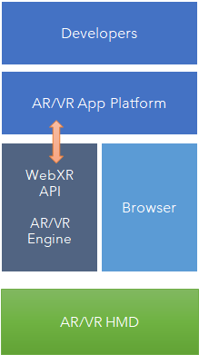

半导体产业是全球第三次工业革命的基础，是物理、化学、数学等基础科学作用于工业应用的结晶，国际科技产业竞争的制高点，也将继续影响第四次工业革命，未来20年半导体产业的发展受到多种因素的影响，包括技术层面的路径选择，全球电子产业供应链发生的变化以及未来10年智能连接社会带来的产品和商业模式变化。

上一次的危机发生在25nm工艺节点，平面MOSFET transistor构型，随着channel尺寸减小，gate的控制电压也一路下降，直到20nm节点附近，如果再降低gate电压source和drain之间的漏电流将难以被控制，gate电压如果不随着制程工艺提升继续下降，芯片的功耗也就不再随着工艺提升而改善，为此Intel率先使用了Berkeley的胡正明教授发明的FinFET 3D 晶体管构型，让channel从一面受gate控制变为三面受控制，同时通过在source和drain掺入硅锗等杂质，改善电子流动性，从而可以继续缩小transistor尺寸和gate电压，直到5nm工艺，FinFET构型也不能继续缩下去了，要使用GAA等技术，可以从四个面来控制channel的构型的GAA（Gate All Around）等构型。                                                                                                                                                  

 
这种方式需要在平台安装和运行AR/VR Engine

这种方式不需要在平台安装和运行AR/VR Engine，需要调用web API提供的USB，Bluetooth和网络能力。

